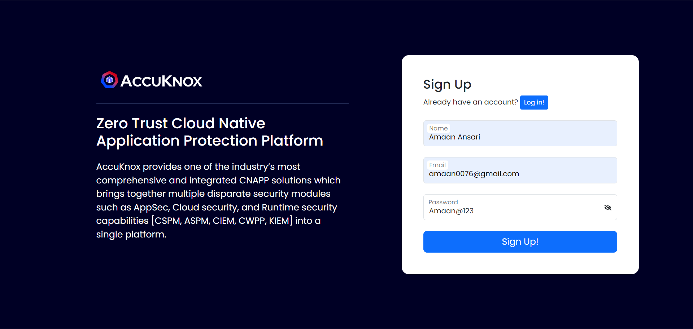
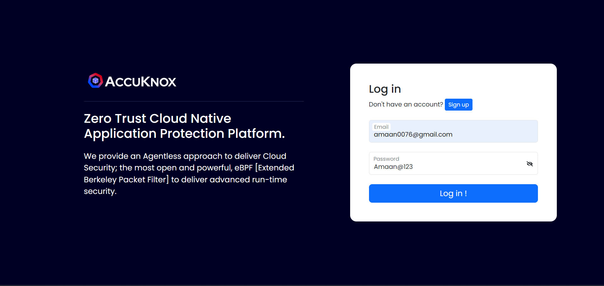

# Dashboard Project

This project is a dynamic dashboard application built using React and Redux, designed to allow users to manage widgets by category. The dashboard features the ability to add, remove, search, and filter widgets, with state management handled by Redux and persistent data stored in local storage.

## Features

**1. Dynamic Widgets Management**

- **Add/Remove Widgets:** Users can easily add or remove widgets within different categories.
- **Redux Actions:** The project uses Redux actions like addWidget and removeWidget to manage widgets efficiently across categories.
- **Local Storage:** Categories and widgets are stored in local storage, ensuring data persistence across sessions.

**2. Modal for Adding Widgets**

- **Two Columns Layout:** The modal includes a two-column layout where the left column displays existing widgets, and the right column contains a form for adding new widgets. The form includes fields for widget name, widget text, and a submit button.
- **Component Structure:** The modal functionality is encapsulated within a separate AddWidget component for better code organization.

**3. Search and Filter Functionality**

- **Search Bar:** A search bar on the dashboard allows users to search for specific widgets.
- **No Results Found:** If no widget matches the search term, a 'No results found' message is displayed.
- **Filter Widgets:** Widgets are filtered based on their isChecked status, and only those marked as true are displayed on the dashboard.

**4. WidgetCards Component**

- **Display Widgets:** Each widget is displayed in a card format, showing its title and description.

**5. Project Structure**

- **Dashboard Component:** The main parent component, responsible for the overall layout and management of the dashboard.
- **WidgetContainer Component:** Manages widgets by categories, handles the modal for adding widgets, and provides searching and filtering functionality.
- **WidgetCard Component:** Displays individual widget details in a card format.
- **AddProject Component:** Centralizes all addition and removal functionalities for widgets within the application.

## Installation

Clone the repository using HTTPS:

```bash
git clone https://github.com/AmaanxAnsari/Dashboard-Assignment.git
```

Clone the repository using SSH Key:

```bash
git@github.com:AmaanxAnsari/Dashboard-Assignment.git
```

1.  Navigate to the project directory:

```bash
cd Dashboard-Assignment
```

2. Install dependencies:

```bash
npm install
```

3. Start the development server:

```bash
npm start
```

## Note:

- Bcryptjs is a nodejs library used for hashing passwords and mostly used in backend development , it is used in this project just for general purpose but not recommended to use in Frontend development.
- While installing dependencies bcryptjs will give warning either ignore it wont affect project execution or make certain changes in your node_modules.
- **node_modules\react-scripts\config\webpack.config.js**

```bash
resolve:{
fallback: {
      "crypto": false
    }
}

```

- add fallback object in resolve object mostly on line 305 or 306
- Restart your app and now the warning will be resolved.

## Important Dependencies

- React
- Redux
- React Redux
- Redux Thunk

## User authentication

- The user authentication components implemented in this project are derived from a previous Accukonx assignment submitted on March 2024, ensuring a consistent and secure user login experience across applications.

- [Github Link](https://github.com/AmaanxAnsari/User-Authentication)
- [Readme File](https://github.com/AmaanxAnsari/User-Authentication/blob/main/README.md)

## Usage

- Once the application is running, you can sign up with a new username and password and user credentials will be stored in localstorage.
- After successful authentication, you will be redirected to the Dashboard section where you can see a Basic dashboard design containing Widget Cards a Add Widget button as well as Logout Button and Search bar.
- **Add/Remove Widgets:** Use the AddProject component to add or remove widgets.
- **Search and Filter:** Utilize the search bar to find specific widgets and filter them based on the isChecked status.
- **Persistent State:** The application uses Redux and local storage to manage state across sessions.

- Clicking on the logout button will log you out from the application.

## Screenshots

### Signup Page



- Users can sign up with a unique username, email and password.

### Login Page



- Upon Successful Registration user is redirected to login page.
- Enter your registered credentials to login.
- User credentials are stored in localstorage for further verification.
- Password is hashed using bcryptjs Library.

### Dashboard


- After successful authentication, you will be redirected to the Dashboard section where you can see a Basic dashboard design containing Widget Cards a Add Widget button as well as Nav Bar containing Logout Button and Search bar.

### Add Widget Button


- There is a Add Widget button highlighted in grey color which open a modal on Clicking to Add Widgets/Remove Widgets.

### Add Widget Modal


- Modal consist of two columns one for Widget Lists and one for contains a form for adding new widget.
- Status of the previous wigets are shown as checked or unchecked with the help of checkbox.

### Add Widget Details


- To add new Widget one can fill the form present on the right column of the modal.
- For basic assignment purpose only Widget Title and Widget Text is used for widget details.
- After filling all the details click on Save Widget button.

### Updated Widget List


- The Widget List on the left column of the Modal is updated with the newly added widget.

### Widget Added in Local Storage


- The widget array in local storage is also updated with all the details.

### Initial Status of the Newly Added Widget


- By default the status of the widget is unchecked(false).

### Update Widget Status


- User can check the checkbox present in front of available widgets in the widget list to show them on the Dashboard.

### Updated Widget Status in Local Storage


- As user checks their required widgets and click on Save Changes button the status is updated from false to true.

### Updated Dashboard


- The widget is added to Dashboard.
- Similar steps can be carried out to remove widgets , user will just have to click on add widget button and check or uncheck the checkbox in front of the widgets present in widget list and click on save changes button.

### Search Widgets


- User can search widgets present on the dashboard with the help of search bar present in the Nav Bar.
- Searched widgets from the category will be shown.
- If a particular category does not have a widget it will display "No Widget Found" as a message.

## Authors

- [@AmaanxAnsari](https://www.github.com/AmaanxAnsari)

## Support

For support, email amaan0076@gmail.com.

## Disclaimer

#### All logos and branding used in this project are the property of AccuKnox. [@AmaanxAnsari](https://www.github.com/AmaanxAnsari) does not hold any rights to these assets. They are included solely for assignment purposes. Please do not use, distribute, or modify any of these materials without proper permission from AccuKnox.
